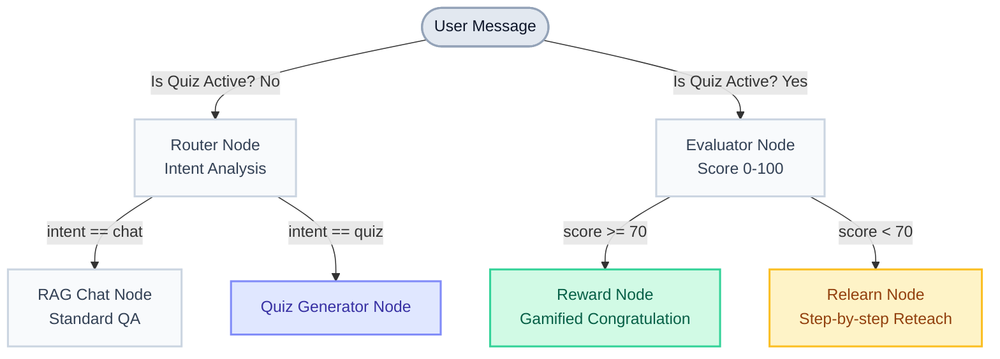
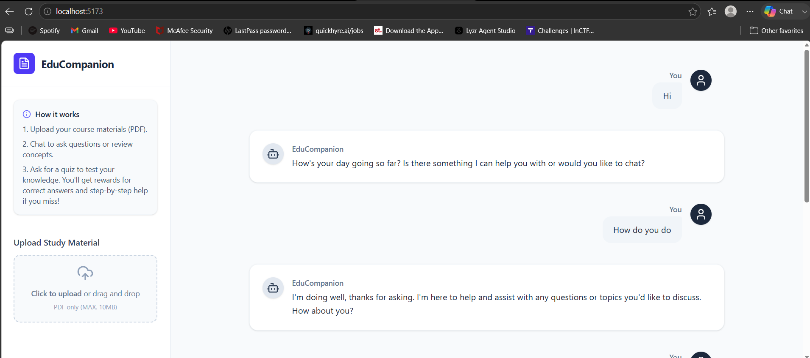
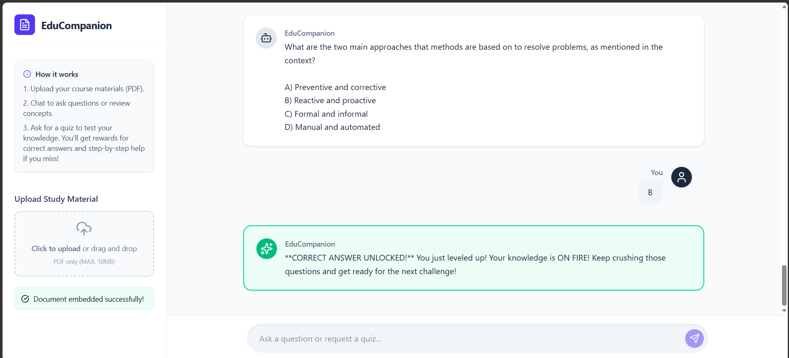
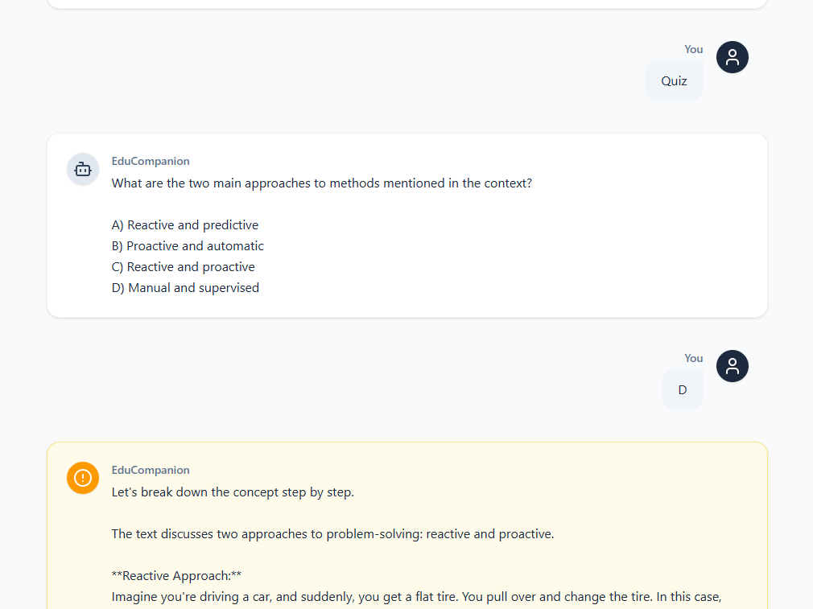

# EduCompanion 🎓

EduCompanion is a single-agent, local intelligent tutoring system designed to help students learn, test their knowledge, and deeply understand their course materials. Built for the IBM SkillsBuild internship, it uses a deterministic AI workflow to provide tailored RAG-based chatting, automated quiz generation, and personalized feedback.

---

## ✨ Features

- **Document Processing**: Upload any PDF course material, which is embedded locally using HuggingFace models and stored in ChromaDB.
- **Intelligent Routing**: The AI determines if you want to chat normally or if you are requesting a quiz.
- **Automated Quizzes**: Generates multiple-choice questions dynamically based on the uploaded context.
- **Tailored Feedback Loop**:
  - 🟢 **Reward**: Answer correctly (>= 70%) and get a gamified, enthusiastic congratulatory response.
  - 🟠 **Relearn**: Answer incorrectly (< 70%) and the AI will break down the concept step-by-step to reteach it simply.
- **Premium UI**: Clean, modern React interface built with TailwindCSS, featuring distinct aesthetic states for different types of AI feedback.

---

## 🏗️ Architecture

EduCompanion relies on a strict LangGraph state machine rather than a generic autonomous agent. This ensures a highly deterministic and educational flow.



---

## 🛠️ Tech Stack

**Backend**
- Python 3.11+
- FastAPI & Uvicorn
- LangGraph & LangChain (Groq LLM)
- ChromaDB (Local Vector Store)
- HuggingFace Embeddings (`all-MiniLM-L6-v2`)

**Frontend**
- React 18 (TypeScript)
- Vite
- TailwindCSS v4
- Lucide React (Icons)

---

## 🚀 Getting Started (Local Development)

### 1. Clone & Setup Backend
```bash
cd edu-companion/backend
python -m venv venv
# Activate the virtual environment
# Windows: venv\Scripts\activate
# Mac/Linux: source venv/bin/activate

pip install -r requirements.txt
```
*Note: Create a `.env` file in the `backend` folder and add your Groq API key: `GROQ_API_KEY=your_key_here`*

### 2. Start the Backend
```bash
uvicorn main:app --reload
```
*Runs on http://localhost:8000*

### 3. Setup & Start Frontend
In a new terminal window:
```bash
cd edu-companion/frontend
npm install
npm run dev
```
*Runs on http://localhost:5173*

---

## 📸 Screenshots


### Chat Mode

### Reward for a quiz

### Reteach if wrong
